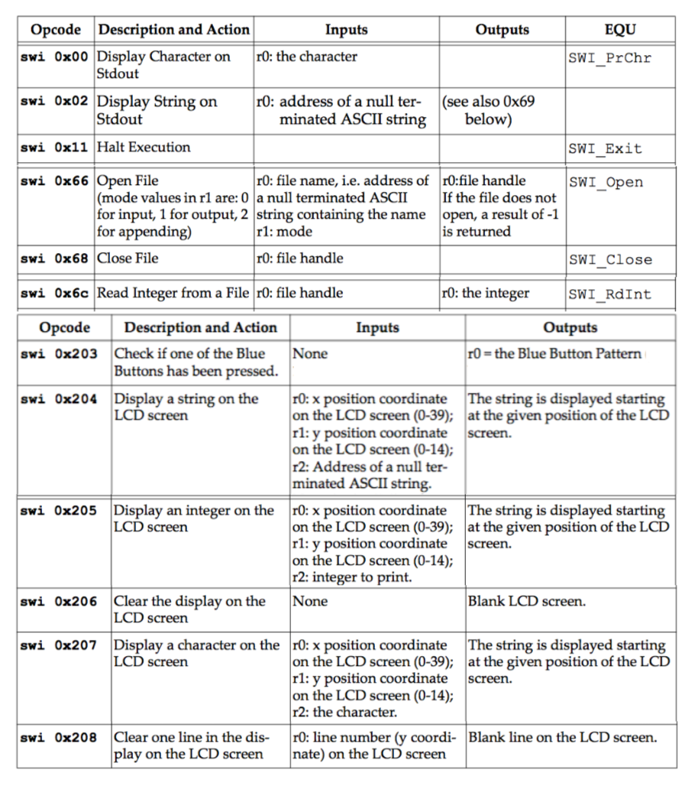

# COL216
## Lab Test
Design a program in ARM assembly language to fill up a SUDOKU puzzle. This puzzle requires
digits 1 to 9 to be filled in a 9 x 9 grid, sub-divided into nine 3x3 blocks, such that each row, each
column and each block has exactly one occurrence of each digit. The grid has a few numbers
initially filled. These initial values are to be read from a file. The numbers filled in subsequently are
to be entered from the 4x4 keyboard (blue buttons) of the Embest board plug-in. The grid is to be
displayed in the LCD screen of the Embest board plug-in. The messages about successful
completion and wrong moves may be displayed on the same LCD screen or on the Stdout. SWI
codes are given below. Clearly define your user interface and overall design at high level. Structure
your program into multiple files. Each file should not be more than a page in the answer script. Put
enough comments in the code to make it easily understandable.

